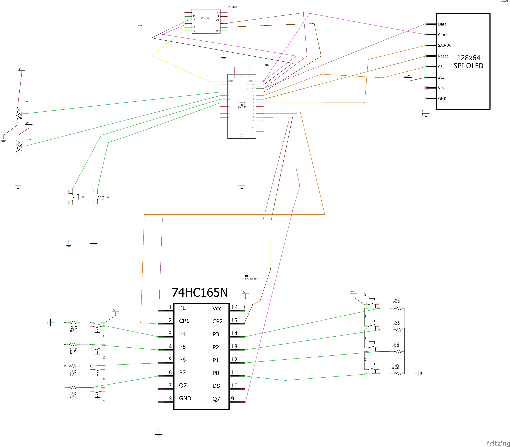
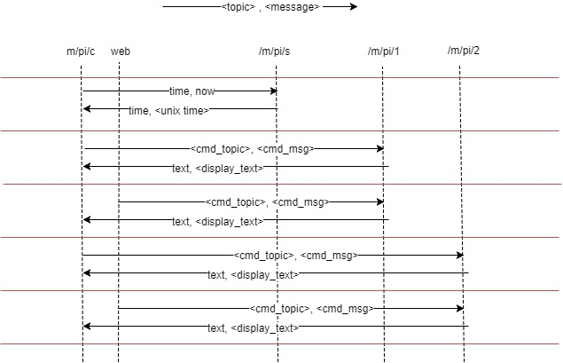

### Why
> Because I could

### License
> Beerware 

### The beginning
> rmc (Remote Monitor Command) - project for my two monitors connected to raspberry pi:s. That I use for watching twitch and youtube. I have built a controller based on Arduino to control the raspberry pi:s. The controller launches programs and controls the volume. All communication is done over MQTT. I'm using this to I don't have to use VNC, ssh or connect a keybord and mouse.


> * Yes, I'm not a programmer so the once that know what they are doing will cry.

> * Yes, You can use this to execute commands that you shouldn't .ie wipe your system etc if you configure that...


> * Some day I may add "Alexa" or "Google home" to support voice command either as appliance or on a raspberry

### Pictures

### Hardware setup
* 2 raspberry pi 3
* 2 monitors
* 1 linux server
* 1 diy controller box

### Software
|directory|description|
|---|---|
|arduino|Code running on the Arduino controller box|
|client|Runs on the raspberry pi:s and listen for commands to execute|
|lib|Start/stop scripts for systemctl|
|pic|Pictures 
|server|Runs on the linux server (Ubuntu) and sends out unixtime to the Arduino*|
|web|HTML client to send commands, current running on the linux server|


### Raspberries:
> They are running a basic installation of raspbian so for every raspberry

> Clone the repository
```
git clone https://github.com/wbcode/rmc.git
```
> Install dependencies
```
pip install paho-mqtt
sudo apt install xdotool
```

> Add service for client
```
cd rmc
chmod 755 rmc.py
sudo cp lib/systemd/system/rmc.service /lib/systemd/system
sudo systemctl enable rmc.service
```
> Edit the configuration file to fit your commands and your local network
```
vi client/rmc.conf
```
> Start the rmc
```
sudo systemctl start rmc
```

#### Raspberries tweek options - use as needed
##### xdotool
> xdotool - used to move mouse, kill programs in X etc
```
sudo apt install xdotool
```

##### unclutter
> unclutter - hide the mouse point 
```
sudo apt install unclutter
echo "unclutter &" >> .xinitrc
```
##### chromium tweeks
>>Remove the chromium crashed dialog 
```
cd
vi .bashrc
```
> Add at the end
```
sed -i 's/"exited_cleanly":false/"exited_cleanly":true/' ~/.config/chromium/'Local State'
sed -i 's/"exited_cleanly":false/"exited_cleanly":true/; s/"exit_type":"[^"]\+"/"exit_type":"Normal"/' ~/.config/chromium/Default/Preferences
```


### Linux server
> Using mosquitto
> Add websocket listerner to mosquitto to be able to use HTML client:
```
vi /etc/mosquitto/conf.d/websocket.conf
```
> Make sure the following is in the file
```
listener 1883
listener 1884
protocol websockets
```
> Restart
```
sudo systemctl restart mosquitto
```


#### Options
> Since my linux server is always on and I have oled display on my controller I want to be able to display the current time. Without an RTC module the Arduino wanders away from real time pretty fast. So to sync time on Arduino it ask the linux server for the time.
> I'm using MQTT to do this since the Arduino NTP library will use to much memory and I already have the MQTT library in place.
> The only thing currently the server part of rmc is doing is to listen for time request in MQTT-topic **/pi/s/time** and response to that by publishing the current UNIX-time in MQTT-topic **/pi/c/time**
> So if you not using the feature or what to tweek it to fit your setup it's easy. You can run this part on one of the raspberries as well.

> Add service for client
```
cd rmc
chmod 755 rmc.py
sudo cp lib/systemd/system/rmcserver.service /lib/systemd/system
sudo systemctl enable rmcserver.service
```
> Edit the configuration file to fit your commands and your local network
```
vi server/rmcserver.conf
```
> Start the rmc
```
sudo systemctl start rmcserver
```

### Controller Arduino
> Hardware
```
1 - Arduino Nano
1 - 74HC165N (parallell to serial)
1 - 128x64 oled display (8 pin)
1 - W5100 Ethernet Shield Module
2 - 10k Slite pot  
8 - 220 resistors
10 - push on/off switches
```



### MQTT communication flows

